**(デモ 7) アカデミックスカラロボットによるパレタイジングデモ **

.. contents::
.. sectnum::

.. raw:: html

   

Introduction
============

このページで体験すること
------------------------
ヴイストン株式会社製アカデミックスカラロボットと Web カメラを組み合わせてパレタイジングを行います．パレタイジングの画像処理には，一例として AR マーカを用います．

ActiveX について（必ずお読みください）
--------------------------------------
本チュートリアルは ActiveX を使用しています．よって，次のような警告が出た際は「ブロックされているコンテンツを許可」もしくは「はい」を選択します．

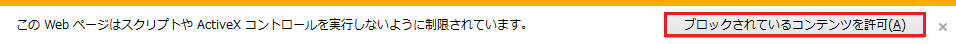

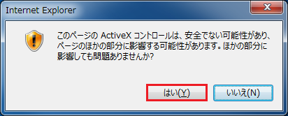

準備するもの
------------

ハードウエア
~~~~~~~~~~~~

アカデミックスカラロボット（ VS-ASR ）
""""""""""""""""""""""""""""""""""""""
ヴイストン株式会社より販売されている，ロボットの制御技術を学習するためのロボットプログラミング教材です．以下のリンクより製品情報を参照することができます．

.. raw:: html

    
<a target="_blank" href="https://www.vstone.co.jp/products/scara_robot/">https://www.vstone.co.jp/products/scara_robot/</a>
 

.. figure:: media/scararobot_axis.png
   :figclass: align-center

Web カメラ
""""""""""
USB で PC に接続できるタイプのカメラが必要です． Web カメラの販売元から明るさやホワイトバランスを調整できるソフトウエアが同梱されているものが望ましいです．ここでは例として， Logicool 社製の C600 を示します．

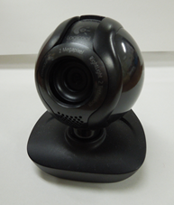

PC
""
以下に示す OS およびブラウザが必要です．

* OS: Microsoft Windows 7 / 8
* ブラウザ: Microsoft Internet Explorer(IE) 8 / 10 (IEは標準でインストールされています)

パレタイジングキューブ
""""""""""""""""""""""
アカデミックスカラロボットに同梱されているスポンジキューブを用いて，パレタイジングキューブを作製します．

1. "armarker_for_palletizing.pdf" を A4 用紙に印刷します．印刷の際にオプションで拡大・縮小されないように注意します（ Adobe Reader の場合，「サイズオプション」の「実際のサイズ」を選択します）．

.. raw:: html

	<a class="reference external"  href="javascript:void(0)" onclick="call_ScaraRobotPallet_Open_ArmarkerPdf(); return false;">./misc/VstoneScaraRobotRTC/Palletizing/Tools/armarker_for_palletizing.pdf</a>

2. 枠線に沿って，R，T，Mのマーカをそれぞれ1つずつはさみ等で切り離します．

3. 下図に示すように，両面テープでスポンジキューブに貼り付けます．

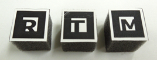

キャリブレーション用座標平面
""""""""""""""""""""""""""""
ロボット座標系とカメラ座標系のキャリブレーションに用います．

1. "robot_calibration_grid.pdf" を A4 用紙に印刷します．印刷の際にオプションで拡大・縮小されないように注意します（ Adobe Reader の場合，「サイズオプション」の「実際のサイズ」を選択します）．

.. raw:: html

	<a class="reference external"  href="javascript:void(0)" onclick="call_ScaraRobotPallet_Open_CalibrationGridPdf(); return false;">./misc/VstoneScaraRobotRTC/Palletizing/Tools/robot_calibration_grid.pdf</a>

2. 枠線に沿って，はさみ等で切り離します．

3. 下図にしたがって，テープ等でロボットの土台に貼り付けます．

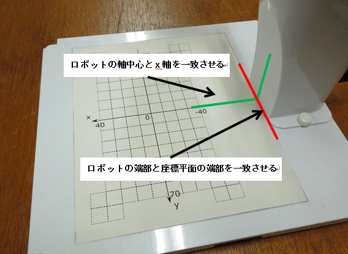

ソフトウエア
~~~~~~~~~~~~
本チュートリアルで準備されているので，基本的には必要なソフトウエアはありません．

カメラのレンズキャリブレーション
--------------------------------

カメラのレンズキャリブレーションを行い，カメラパラメータファイルを生成します．カメラレンズ固有の歪みを矯正するために必要です．

1. "calib_dist.pdf" を A4 用紙に， "calib_cpara.pdf" を A3 用紙に印刷します．印刷の際にオプションで拡大・縮小されないように注意してください（ Adobe Reader の場合，「サイズオプション」の「実際のサイズ」を選択します）．次のリンクをクリックしてキャリブレーションに必要な pdf を開くことができます．

.. raw:: html

	<a class="reference external"  href="javascript:void(0)" onclick="call_ScaraRobotPallet_Open_CalibDistPdf(); return false;">./misc/ARToolKit/calib_dist.pdf</a>  
	<a class="reference external"  href="javascript:void(0)" onclick="call_ScaraRobotPallet_Open_CalibCparaPdf(); return false;">./misc/ARToolKit/calib_cpara.pdf</a>

2. レンズキャリブレーションの手順は以下のURLより参照できます． "Two Step Calibration" を選択してください．

.. raw:: html

    
<a target="_blank" href="http://www.hitl.washington.edu/artoolkit/documentation/usercalibration.htm">http://www.hitl.washington.edu/artoolkit/documentation/usercalibration.htm</a>

ARToolKitのうち，レンズキャリブレーションに必要なプログラムを本チュートリアルに同梱しています．次のリンクをクリックして，該当するプログラムを開くことができます．

.. raw:: html

    <a class="reference external"  href="javascript:void(0)" onclick="call_ScaraRobotPallet_Start_CalibDist(); return false;">./misc/ARToolKit/calib_dist.exe</a>  
   	<a class="reference external"  href="javascript:void(0)" onclick="call_ScaraRobotPallet_Start_CalibCparam(); return false;">./misc/ARToolKit/calib_cparam.exe</a>

レンズキャリブレーションを実施する際の注意点を以下に挙げます．

* 印刷したキャリブレーションパターンは平らな板に張り付けて使用してください．
* 「Image size」は大きめの方が操作しやすいです（本チュートリアル作成時は，640x480を選択しています）．選択した「Image size」は， "DetectArMarkerRTC" を実行する際に同値を用います．
* "calib_dist.exe"によるキャリブレーションにおいて，ドラッグして点を囲む際，上記リンク先の「 Figure 2 」にあるように，点のみが白，周りがすべて黒と鮮明に表示されることを確認してください．前述のようにならず，周りにも白が混ざる場合は，正しい値を取得できていません．照明条件や角度等を工夫して24点すべてで正しく取得できるようにしてください．
* "calib_dist.exe"によるキャリブレーション終了時に表示されるパラメータ（ Center X，Center Y，Dist Factor） は外部出力されませんので，書き留めてください．

3. カメラパラメータファイルの名前を "camera_para.dat" に変更し，以下に示すディレクトリへコピーします．上書き確認されますので，"移動して置換"を選択します．::

    ..\DetectArMarkerRTC\Data

チュートリアル実施手順
======================
以下，特に指定ない限り，配布 USB のホームディレクトリに居ることを前提とします．

nameserver 起動 (全チュートリアル共通)
--------------------------------------
基本的に `OpenRTM` の `nameserver` は一度起動すると，起動したままでもすべてのチュートリアルは動作すると思われます．

1) 次のリンクをクリックして `nameserver` を起動．

.. raw:: html

    <ul>
     <li><a class="reference external" href="javascript:void(0)" onclick="call_rtmnamerserver(); return false;">rtm-naming.bat</a></li>
    </ul>

2) （上記方法でうまく行かなかった場合のみ以降実施） `Explorer` で `demo` フォルダを開き，`rtm-naming.bat` をダブルクリックして実行．

- `cmd.exe` (Command prompt) が開きっぱなしになり，次のような文言が表示されれば成功．::
    
    Starting omniNames for the first time.
    :
    Checkpointing completed.

3) 上記手順で `cmd.exe` が消えてしまう場合は，`nameserver` がうまく起動していないので次の手順で原因を発見：

  3.1) `Explorer` 上で，USB のドライブ名を確認 (D/E/F etc. ここでは `F` と仮定)

  3.2) `cmd.exe` を手動起動 (Win 7: [2_], Win 8: [3_])

  3.3) 以下コマンドでフォルダ移動・コマンド実行::

    prompt> F:
    prompt> cd demo
    prompt> rtm-naming.bat

  エラー等発生していればここで表示されるのでその内容を診断．`OpenRTM` の `nameserver` の問題は WEB で検索して対処してみてください．

チュートリアルのプログラム実行
------------------------------

すべてのRTCをActivateするまで
~~~~~~~~~~~~~~~~~~~~~~~~~~~~~

1) 次のリンクをクリックして `./demo/ScaraRobotPalletizingDemo/StartRTC.bat` を実行します．起動できない場合は，手動で `Explorer` から実行します．

.. raw:: html

    <a class="reference external" href="javascript:void(0)" onclick="call_ScaraRobotPallet_StartRTC(); return false;">./demo/ScaraRobotPalletizingDemo/StartRTC.bat</a>

2) 次のリンクをクリックして `./demo/RTSE.bat` を実行します．起動できない場合は，手動で `Explorer` から実行します．

.. raw:: html

	<a class="reference external"  href="javascript:void(0)" onclick="call_rtseditor(); return false;">./demo/RTSE.bat</a>

RT System Editor が下図のように起動します．

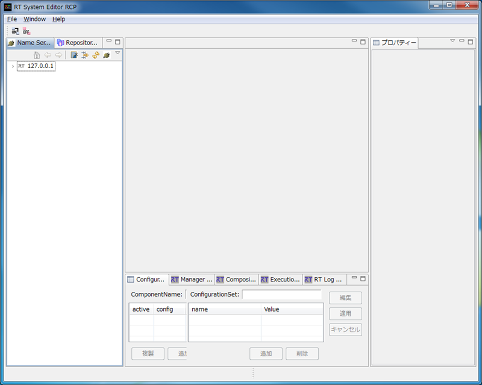

3) 次のリンクをクリックして `./demo/ScaraRobotPalletizingDemo/ConnectAndActivateRTC.bat` を実行します．起動できない場合は，手動で `Explorer` から実行します．

.. raw:: html

	<a class="reference external"  href="javascript:void(0)" onclick="call_ScaraRobotPallet_ConnectAndActivateRTC(); return false;">./demo/ScaraRobotPalletizingDemo/ConnectAndActivateRTC.bat</a>

4) 手順5～11では，手順3でバッチファイルが自動実行する内容を手動で行う場合の手順について解説します．手順3に成功している場合は，手順12に進んでください．

5) 左側のペインで 127.0.0.1 を選択し，直上の右矢印をクリックすると，起動中の RT Component が同ペイン上に表示されます．ここでは `DetectArMarkerRTC` ， `ScaraRobotArRTC` ， `VS_ASR_RTC` の3つとなるはずです．

6) 同ペイン上で直上左にある "ON" というアイコンをクリックすると， `System Diagram` が真ん中のペインに開かれます．

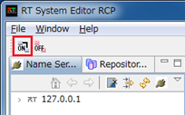

7) 左側のペインから各 RTC を System Diagram にドラッグ＆ドロップします．

8) コンフィギュレーションを設定します．System Diagram 上で，`ScaraRobotArRTC`をクリックし，選択します． System Diagram の直下にある Configuration View にある，「RobotName」の Value を「ROBOT_NAME」から「SCARA」に変更し，「適用」をクリックします．同様に「Speed」のValueを「30」から「40」に変更し，「適用」をクリックします．

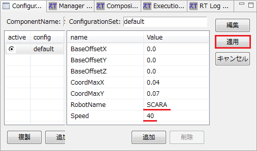

9) サービスポートを接続します．下図に示すように，一方の RTC の"□"上でドラッグし，もう一方の RTC の"□"上でドロップします． "Port Profile" のウィンドウが表示されますので，変更せずに "OK" を選択します．接続されたサービスポートは"水色"に変化します．なお，サービスポートの接続を間違えた場合は， "Port Profile" のウィンドウにおいて，"一致するポートインターフェースがありません。"と警告されます．

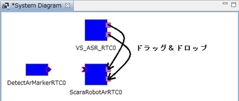

10) データポートを接続します．下図に示すように，一方の RTC の"□"上でドラッグし，もう一方のRTCの"□"上でドロップします．("□"は，一方が四角形に三角形を足した形，もう一方が四角形から三角形をくり抜いた形です)． "Connector Profile" のウィンドウが表示されますので，変更せずに "OK" を選択します．接続されたデータポートは黄緑色に変化します．

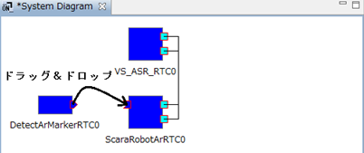

11) 同ペイン上で直上左にある "ALL" というアイコンをクリックし，すべての RTC を Activate します．

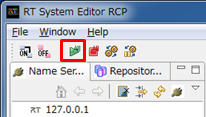

12) `DetectArMarkerRTC` が正常に起動すると，次のようなビデオプロパティを設定するウィンドウが表示されます．このうち，"出力サイズ"の設定値を1.4節のカメラのレンズキャリブレーションで用いたものを同値に設定してください．設定後は "OK" を選択します．

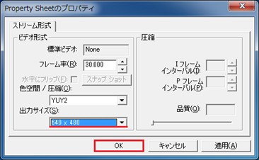

13) ビデオが正常に初期化されると，下図に示すようなキャプチャウィンドウが表示されます(ウィンドウが表示されるまで多少の時間を要する場合があります)．

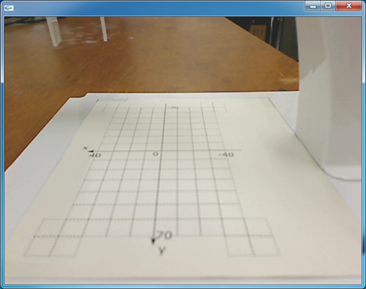

14) `ScaraRobotArRTC` が正常に "Activate" されると，下図に示すような状態になります．

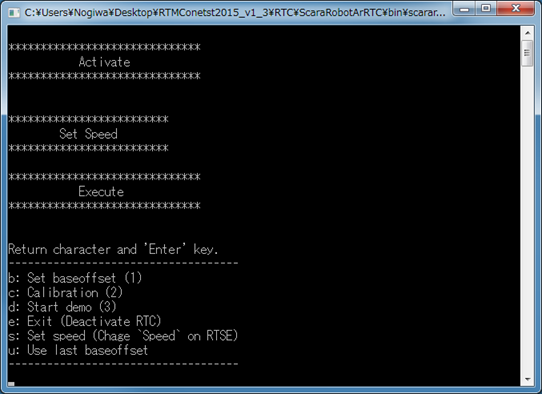

15) `VS_ASR_RTC` が正常に "Activate" されると，下図に示すような状態になります．

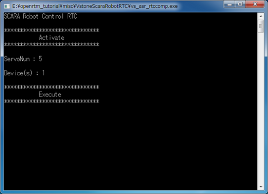

16) すべてのRTCを参照しますので，下図を参考に見やすい形に並べてください．

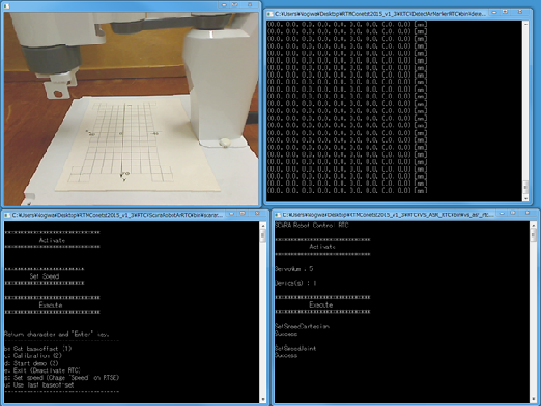

すべてのRTCをActivateした後
~~~~~~~~~~~~~~~~~~~~~~~~~~~

17) ベースオフセットを設定します．`ScaraRobotControlRTC`のコンソールウィンドウにおいて，キーボードを「b」，「Enter」キーの順に押します．以下のように表示されたことを確認した後，ロボットのハンドを手動で座標系の原点位置に移動させます．素早く動かすとロボット故障の原因となりますので注意してください．::

    (1st) Move the robot hand to the point of origin manually.
    (2nd) Press 's' and 'Enter' key."

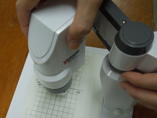

18) ハンドを位置決めしたら，キーボードを「s」，「Enter」キーの順に押します．

19) キャリブレーションを行います．`ScaraRobotControlRTC`のコンソールウィンドウにおいて，キーボードを「c」，「Enter」キーの順に押します．

20) 下図に示すように，マーカ "R" を貼り付けたキューブを座標 (x, y) = (0, 0) に置きます．

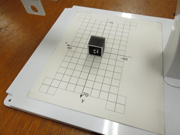

21) キャプチャウィンドウでマーカを含めたキューブが下図に示すように青線の立方体で囲まれていることを確認してください．これがARマーカを認識できていることを示します．認識されない場合は，以下に示す3つの項目で調整してください．

a. Webカメラの角度，照明条件を変更する．

b. カメラキャプチャ画像の2値化の閾値を変更する．
`DetectArMarkerRTC`は2値化の閾値（0～255）を変更するためのコマンドを実装しています．`DetectArMarkerRTC`のキャプチャウィンドウを選択し，キーボードで以下に示すキーを選択することでそれぞれ実行できます．

- p：2値化の閾値を+1
- m：2値化の閾値を-1
- n：現在の2値化の閾値を`DetectArMarkerRTC`のコンソールウィンドウに表示

c. Webカメラに同梱されているアプリケーションでキャプチャの明るさを変更する（明度を上げることで改善される場合が多いです）．

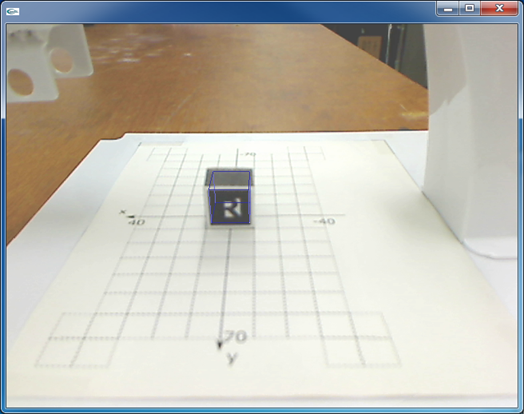

22)	同様に`DetectArMarkerRTC`のコンソールウィンドウの出力を参照し，出力値が安定していることを確認してください．安定しない場合は，手順21で述べた手段を用いて対処してください．

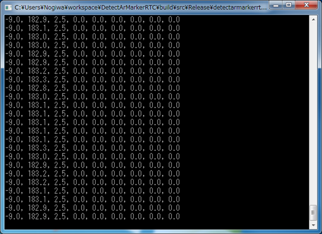

23) キーボードの「Enter」キーを押して，マーカ座標を取得します．

24) 下図に示すように，マーカ "R" を貼り付けたキューブを座標 (x, y) = (-40, -70) に置き，手順21～23を繰り返します．

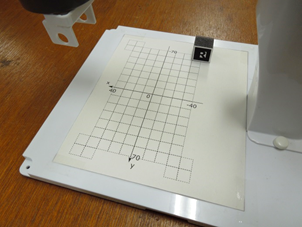

25) 下図に示すように，マーカ "R" を貼り付けたキューブを座標 (x, y) = (40, -70) に置き，手順21～23を繰り返します．

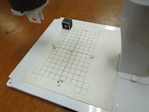

26) 下図に示すように，マーカ "R" を貼り付けたキューブを座標 (x, y) = (40, 70) に置き，手順21～23を繰り返します．

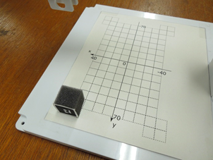

27) 下図に示すように，マーカ "R" を貼り付けたキューブを座標 (x, y) = (-40, 70) に置き，手順21～23を繰り返します．

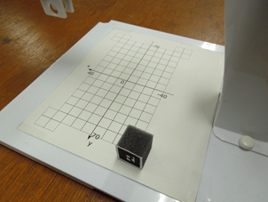

28) キャリブレーションによる設定値を確認します． `ScaraRobotControlRTC` に以下のように表示されていることを確認し，任意の位置に，マーカ "R" ， "T" ， "M" を貼り付けたキューブを配置します．::

    (1st) Put 'R', 'T' and 'M' marker.
    (2nd) Return 's' and 'Enter' key.
    
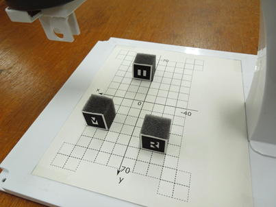

29) キーボードの "Enter" キーを押すと，値の取得が行われますので配置した位置と大きな相違がないことを確認します(±5mm程度目安です)．大きく異なる場合は，手順19からやり直してください．

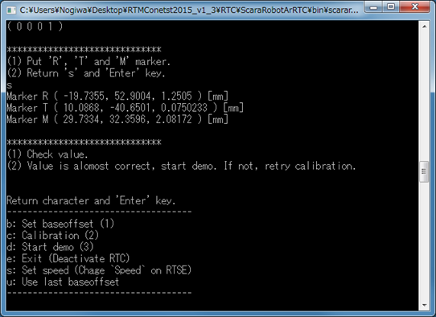

30) 「ScaraRobotControlRTC」のコンソールウィンドウにおいて，キーボードを「d」，「Enter」キーの順に押すと，デモが開始されます．ARマーカを用いたパレタイジングデモの流れを下図に示します．ARマーカから位置を認識しているのは移動前のみとなります．移動後の位置はあらかじめプログラム内に格納された値です．なお，デモを終了する場合は，「ScaraRobotControlRTC」のコンソールウィンドウにおいて，キーボードの「Esc」キーを押してください．下図フローのうち，2番目もしくは4番目が終了した時点で中断されます．

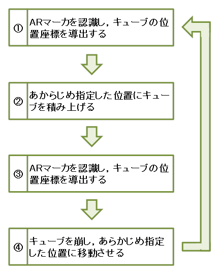

Go back to `index <top.html>`__ | Go to `next <2.1_samplewordlogger.html>`__ |

Choose `Other language <index.html>`__

